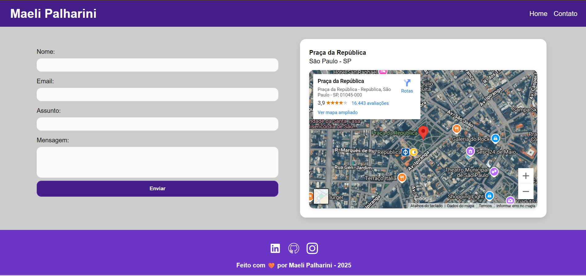

# 📄 Portfólio Pessoal – Generation Brasil

Este repositório contém uma página de portfólio desenvolvida como parte da atividade Fundamentos da Web do bootcamp da Generation Brasil.
O objetivo é praticar HTML, CSS e conceitos básicos de acessibilidade e responsividade na construção de páginas estáticas.

## 🖼️ Prévia

## 🚀 Tecnologias utilizadas

- HTML5 – estrutura semântica da página

- CSS3 – estilização e layout responsivo

- Google Maps Embed – mapa incorporado na seção de contato

##  📚 Aprendizados

Durante o desenvolvimento deste projeto, foram praticados:
    
    - Estruturação de páginas com HTML semântico
    
    - Criação de layouts utilizando Flexbox e Grid
    
    - Estilização e uso de variáveis no CSS
    
    - Melhores práticas de acessibilidade
    
    - Inclusão de mídias externas (Google Maps, ícones SVG)

## 💻Autor(a)

Projeto desenvolvido por Maeli Palharini durante o bootcamp Generation Brasil – Fundamentos da Web (2025).